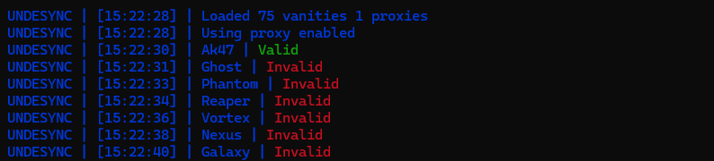

# Discord Vanity Checker
Using the discord api to check if a vanity url is available to use or is already taken.

## Configuration
1. Add the vanity url you want to check in the `vanity.txt` file.
2. Add your proxy in the `proxy.txt` file. (Optional but recommended)
3. If you wont use a proxy change the `config.json` file to `false` in the `proxy | enabled`.
4. Run the script.

## Misc
- You can change the delay on the line `31` in the `index.js` file.
- Proxy format: `username:password@ip:port`

## Config
```json
{
    "proxy" : {
        "enable" : true // If you want to use a proxy
    },
    "saves" : {
        "enable" : true, // If you want to save the results
        "valids" : true, // If you want to save the valids
        "invalids" : true // If you want to save the invalids
    }
}
```
#
### Example


[Discord](https://discord.gg/undesync)
